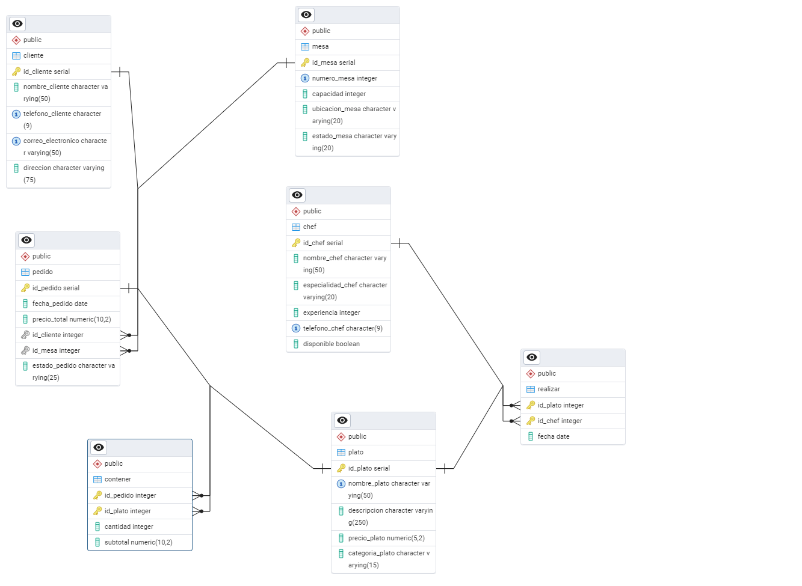
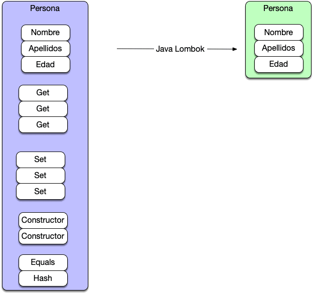

# Proyecto Restaurante

* * *

## Índice

1. [Explicación de la Base de Datos](#explicación-de-la-base-de-datos)
2. [Explicación del proyecto](#explicacion-del-proyecto)
3. [Instrucciones de uso](#instrucciones-de-uso)
4. [Uso de PostgreSQL](#uso-de-postgresql)
5. [Uso de Lombok](#uso-de-lombok)
6. [Bibliografía](#bibliografia)

* * *

## Explicación de la Base de Datos

Esta base de datos es sobre un restaurante y está diseñada para gestionar información relacionada con platos, chefs,
clientes, mesas, pedidos y las relaciones entre ellos.
A continuación se describen las tablas con sus relaciones:

### 1. Plato

* **ID_PLATO**:Identificador único del plato (clave primaria).
* **NOMBRE_PLATO**: Nombre del plato (único y no nulo).
* **DESCRIPCION**: Descripción del plato (no nulo).
* **PRECIO_PLATO**: Precio del plato (no nulo).
* **CATEGORIA_PLATO**: Categoría del plato (no nulo).

### 2. Chef

* **ID_CHEF**:Identificador único del chef (clave primaria).
* **NOMBRE_CHEF**: Nombre del chef (no nulo).
* **ESPECIALIDAD_CHEF**: Especialidad del chef (no nulo).
* **EXPERIENCIA**: Años de experiencia del chef (no nulo).
* **TELEFONO_CHEF**: Teléfono del chef (único y no nulo).
* **DISPONIBLE**: Disponibilidad del chef (no nulo).

### 3. Cliente

* **ID_CLIENTE**: Identificador único del cliente (clave primaria).
* **NOMBRE_CLIENTE**: Nombre del cliente (no nulo).
* **TELEFONO_CLIENTE**: Teléfono del cliente (único y no nulo).
* **CORREO_ELECTRONICO**: Correo electrónico del cliente (único y no nulo).
* **DIRECCION**: Dirección del cliente (no nulo).

### 4. Mesa

* **ID_MESA**: Identificador único de la mesa (clave primaria).
* **NUMERO_MESA**: Número de la mesa (único y no nulo).
* **CAPACIDAD**: Capacidad de la mesa (no nulo).
* **UBICACION_MESA**: Ubicación de la mesa (no nulo).
* **ESTADO_MESA**: Estado de la mesa (no nulo).

### 5. Pedido

* **ID_PEDIDO**: Identificador único del pedido (clave primaria).
* **FECHA_PEDIDO**: Fecha del pedido (no nulo).
* **PRECIO_TOTAL**: Precio total del pedido (no nulo, por defecto 0.00).
* **ID_CLIENTE**: Identificador del cliente que realizó el pedido (clave foránea).
* **ID_MESA**: Identificador de la mesa asociada al pedido (clave foránea).
* **ESTADO_PEDIDO**: Estado del pedido (no nulo).

### 6. Contener

* **ID_PEDIDO**: Identificador del pedido (clave primaria y foránea).
* **ID_PLATO**: Identificador del plato (clave primaria y foránea).
* **CANTIDAD**: Cantidad del plato en el pedido (no nulo).
* **SUBTOTAL**: Subtotal del plato en el pedido (no nulo).

### 7. Realizar

* **ID_PLATO**: Identificador del plato (clave primaria y foránea).
* **ID_CHEF**: Identificador del chef (clave primaria y foránea).
* **FECHA**: Fecha en que el chef realizó el plato (no nulo).

### Relaciones

* **PLATO** se relaciona con **REALIZAR** y **CONTENER**.
* **CHEF** se relaciona con **REALIZAR**.
* **CLIENTE** se relaciona con **PEDIDO**.
* **MESA** se relaciona con **PEDIDO**.
* **PEDIDO** se relaciona con **CONTENER**.

* * *

## Explicacion del proyecto

Es una aplicación diseñada para gestionar la información de un restaurante, que incluye platos, chefs, clientes, mesas,
y pedidos.
Sus componentes son los siguientes:

### 1. Plato

* **Descripción**: Gestión de los clientes que realizan pedidos en el restaurante.
* **Atributos**: ID, nombre, teléfono, correo electrónico, dirección.

### 2. Chef

* **Descripción**: Gestión de los chefs que trabajan en el restaurante.
* **Atributos**: ID, nombre, especialidad, experiencia, teléfono, disponibilidad.

### 3. Cliente

* **Descripción**: Gestión de los clientes que realizan pedidos en el restaurante.
* **Atributos**: ID, nombre, teléfono, correo electrónico, dirección.

### 4. Mesa

* **Descripción**: Gestión de las mesas disponibles en el restaurante.
* **Atributos**: ID, número, capacidad, ubicación, estado.

### 5. Pedido

* **Descripción**: Gestión de los pedidos realizados por los clientes.
* **Atributos**: ID, fecha, precio total, cliente, mesa, estado.

### 6. Contener

* **Descripción**: Relación entre los pedidos y los platos que contienen.
* **Atributos**: ID del pedido, ID del plato, cantidad, subtotal.

### 7. Realizar

* **Descripción**: Relación entre los platos y los chefs que los preparan.
* **Atributos**: ID del plato, ID del chef, fecha.

Además sus funcionalidades son las siguientes:

### Funcionalidades Principales

### 1. Gestión de Platos:

* **Agregar Plato**: Permite añadir nuevos platos al menú del restaurante.
* **Obtener Plato**: Permite consultar la información de un plato específico.
* **Listar Platos**: Muestra una lista de todos los platos disponibles en el restaurante.
* **Actualizar Plato**: Permite modificar la información de un plato existente.
* **Eliminar Plato**: Permite eliminar un plato del menú.

### 2. Gestión de Chefs:

* **Agregar Chef**: Permite añadir nuevos chefs al restaurante.
* **Obtener Chef**: Permite consultar la información de un chef específico.
* **Listar Chefs**: Muestra una lista de todos los chefs que trabajan en el restaurante.
* **Actualizar Chef**: Permite modificar la información de un chef existente.
* **Eliminar Chef**: Permite eliminar un chef del restaurante.

### 3. Gestión de Clientes:

* **Agregar Cliente**: Permite registrar nuevos clientes en el sistema.
* **Obtener Cliente**: Permite consultar la información de un cliente específico.
* **Listar Clientes**: Muestra una lista de todos los clientes registrados.
* **Actualizar Cliente**: Permite modificar la información de un cliente existente.
* **Eliminar Cliente**: Permite eliminar un cliente del sistema.

### 4. Gestión de Mesas:

* **Agregar Mesa**: Permite añadir nuevas mesas al restaurante.
* **Obtener Mesa**: Permite consultar la información de una mesa específica.
* **Listar Mesas**: Muestra una lista de todas las mesas disponibles en el restaurante.
* **Actualizar Mesa**: Permite modificar la información de una mesa existente.
* **Eliminar Mesa**: Permite eliminar una mesa del restaurante.

### 5. Gestión de Pedidos:

* **Agregar Pedido**: Permite registrar nuevos pedidos realizados por los clientes.
* **Obtener Pedido**: Permite consultar la información de un pedido específico.
* **Listar Pedidos**: Muestra una lista de todos los pedidos realizados.
* **Actualizar Pedido**: Permite modificar la información de un pedido existente.
* **Eliminar Pedido**: Permite eliminar un pedido del sistema.

### 6. Gestión de Relaciones:

* **Contener**: Relaciona los pedidos con los platos que contienen, incluyendo la cantidad y el subtotal.
* **Realizar**: Relaciona los platos con los chefs que los preparan, incluyendo la fecha de preparación.

### Tecnologías usadas

* ***Java***
* ***PostgreSQL***
* ***Lombok***
* ***Intellij IDEA***
* ***Git y GitHub***

Actualmente la aplicación solo está para nivel administrador, es decir, se tiene acceso a todos los datos y todas las
operaciones. En futuras versiones se corregirá.
* * *

## Instrucciones de uso

Asegurarse de tener instalado  **PostgreSQL**, además de tenerlo configurado correctamente como dice el fichero <u>
applications.properties</u>, añadir el puerto correctamente y el *LocalHost*.
Una vez configurado se recomienda crear una base de datos llamada *Restaurante* para realizar los cambios mínimos,
además las tablas y los datos se crearán en le schema *public* de la misma.
Si se quiere hacer uso de las funciones complejas se ha de copiar las funciones del fichero <u>procedures.sql</u> en la
consola de *PgAdmin4* y ejecutarlas de forma solitaria para almacenarlas en la base de datos.
Una vez realizados estos pasos la aplicación estaría totalmente disponible para el usuario.
Además se dispone de un fichero slq <u>borrar_tablas.sql</u> que elimina todas las tablas de la base de datos, por si se
quiere volver a empezar. Para ejecutarlo tan solo copielo en *PostgreSQL* o ejecutelo en el mismo IDE.
No es obligatorio eliminarla base de datos al realizar cambios.

### Pasos a seguir

1. Al iniciar la aplicación se pedirá al usuario que elija una de las tablas, actualmente al disponer nivel
   administrador están todas, con las que quiere trabajar o si quiere ejecutar una consulta compleja o se podrá salir de
   la aplicación.
2. Al elegir una tabla se podrá insertar un dato, obtener un dato por su identificador, obtener todos los datos,
   actualizar un dato e eliminar un dato. Si se eligió una consulta compuesta dará a elegir entre 2: una es <u>calcular
   los gastos totales de los clientes</u> y la otra es <u>obtener con detalle los pedidos en un rango de fechas</u> (
   introducidas por el usuario). Además se podrá salir para ir de nuevo al menú para elegir tabla.
3. Una vez ejecutada la sentencia volverá a la pantalla inicial, selección de tabla, y se podrá repetir este proceso
   hasta que el usuario quiera salir.

* * *

## Uso de PostgreSQL

Busque información sobre las *SGBD* que piden las empresas. Investigué sobre varios gestores y me decidí por
***PostgreSQL***.
Lo que me hizo decantarme por este sistema gestor de base de datos fue:

* Su instalación y su configuración son fáciles de hacer para cualquier usuario.
* Su herramienta gráfica *PgAdmin* es muy sencilla e intuitiva, además que dispone de multitud de opciones, tanto
  interactuar con la misma base de datos como saber el porcentaje que esta consumiendo de nuestro dispositivo con la
  base de datos en marcha.
* Además el lenguaje *SQL* que utiliza es el estándar, por lo tanto resulta sencillo hacer consultas y scripts.
* Tiene una gran cantidad de extensiones que son compatibles con lenguajes de programación, como con java. También su
  implementación en java es muy sencilla y está todo totalmente documentado de como se tiene que hacer.

* * *

## Uso de Lombok

Me estuve informando del uso de la librería ***Lombok*** y su utilidad es simplificar las clases.
Se utiliza una anotación específica que implementa la librería. En mi caso utilizo *@Data*, que implementa *getter*,
*setters*, ToString* y *EqualsAndHashCode*, y por lo tanto tienes a tu disposición todos los métodos esenciales de una
manera muy sencilla. Además uso la anotación *@AllArgsConstructor*, que genera un constructor con todos los atributos de
la clase y *@NoArgsConstructor* que genera un constructor completamente vacío.
Además deja implementar el código que quieras sobre el código generado.
Aquí he añadido un ejemplo que me hizo decantarme por esta clase, además de explicar de forma clara como funciona esta
clase.

* * * 

## Bibliografia

* **PostgreSQL**: [Documentación PostgreSQL](https://www.postgresql.org/docs/)
* **Lombok
  **: [Documentación oficial Lombok](https://projectlombok.org) - [Web ArquitecturaJava](https://www.arquitecturajava.com/java-lombok-clases-y-productividad/) - [OpenWebinars](https://openwebinars.net/blog/que-es-lombok/)

***

